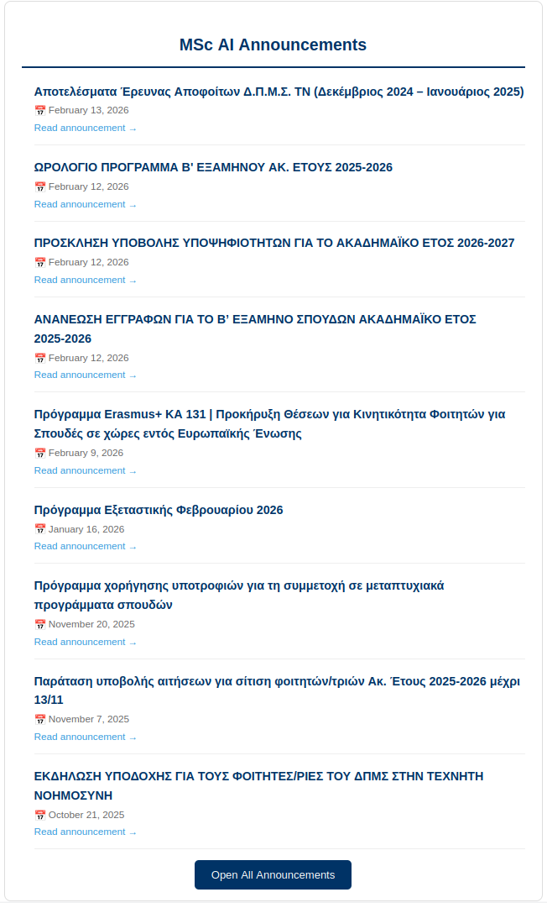

# 🏛️ Hermes: Demokritos MSc AI Announcement Herald

Hermes is an automated notification system designed to monitor the MSc in Artificial Intelligence announcements page at NCSR Demokritos. Since the official site does not provide an RSS feed, Hermes acts as the messenger, delivering new updates directly to your inbox the moment they are posted.

## 📬 How to Subscribe

You can receive these updates in your personal email (Gmail, Yahoo, Outlook, etc.) by joining our dedicated notification group.

1. **Join the Group**: Visit our Google Group `https://groups.google.com/g/demokritos_herald` and **click "Join Group"**.

2. **Set Preferences**: Ensure your subscription is set to **"Each Email"** to receive instant alerts.

3. **Stay Informed**: You will now receive a clean, mobile-friendly email whenever a new announcement is published.

## 🤖 How It Works

Hermes runs on a lightweight, serverless architecture using GitHub Actions and Python:

- Periodic Pulse: Announcements are checked every 4 hours - so you don't miss a thing.
- State Persistence: Hermes will send only the latest announcements without polluting your inbox.
- Broadcast: Hermes formats the announcements in HTML format for that eye-candy pleasure.

## 📧 What the Announcements Look Like

Subscribers receive a structured email designed for readability. Each alert includes:

    Bold Titles: Clearly identified announcement headlines.

    Timestamps: The original posting date from the Demokritos site.

    Quick Links: A direct "Read more" link to the specific announcement page.

    Note: If you are a member of the group and don't see the emails, please check your "Promotions" or "Spam" folder and mark the sender as "Not Spam."

## 🛠️ Contributions & Local Setup

If you are a student in the program and want to improve Hermes, contributions are welcome!
Local Development

    Clone the repository: git clone https://github.com/gpetrousov/hermes.git

    Install dependencies: pip install requests beautifulsoup4

    Run the scraper: python scraper.py

## Feature Roadmap

    [ ] Add keyword filtering (e.g., alert only for "Scholarships").

    [ ] Integration with Discord/Slack webhooks.

Feel free to open an Issue if you notice the scraper failing due to a website layout change.
